# 2022 OSS 수요일 오전반 6조 

## 팀 과제 : Git 기능 정리

  

## Git 기능 정리
1. [이슈](#이슈)
2. [레이블](#레이블)
3. [마일스톤](#마일스톤)
4. [PR](#PR)
5. [위키](#위키)
6. [프로젝트](#프로젝트)

## 이슈

프로젝트를 진행하면서 발생하는 다양한 이벤트들을 의미한다. 발견된 버그나 추가할 기능, 개발해야할 새로운 이슈나 설계사항들을 이슈로 만들어서 동료들과 협업을 진행할 수 있다.

- 1.1 깃허브 이슈 생성
    - 개발자는 깃허브 저장소 페이지의 이슈 탭에서 새로운 이슈를 생성할 수 있다. 이 떄, 개발자는 해당 저장소에 이슈를 생성할 수 있는 권한을 가지고 있어야 한다.

     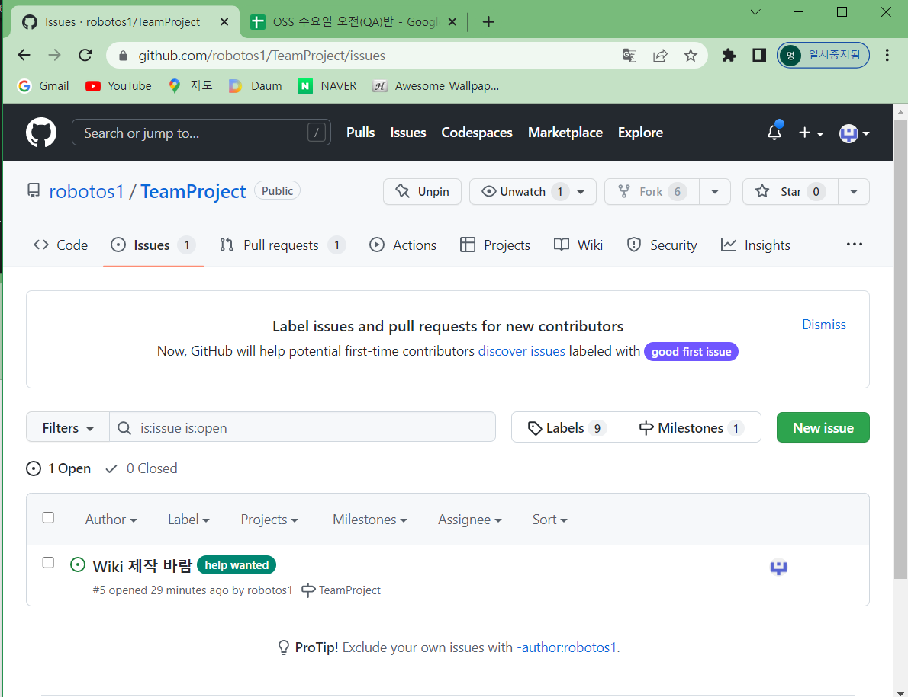

    녹색 버튼을 눌러 새로운 깃허브 이슈를 생성하는 페이지 로드

    

    신규 깃허브 이슈의 title과 내용을 작성하면 'Submit new issue'가 활성화된다.

    신규 깃허브 이슈 작성 화면의 오른쪽을 보면 이슈와 관련된 다양한 기능들을 확인할 수 있다. 우선 이슈의 Assigness를 지정할 수 있다. 이 이슈에 대한 책임자를 지정하여 이슈 해결과 커뮤니케이션을 주도한다. Assigness는 최대 10명까지 지정할 수 있다.

- 1.2 깃허브 이슈 닫기
    - 해결된 이슈는 'Close issue' 버튼을 눌러서 닫아줘야한다. 그래야 해결되지 않은 이슈에 집중할 수 있다.

    이슈가 닫혔다고해서 삭제되는 것은 아니다. Closed상태의 이슈들은 나중에도 볼 수 있다.

- 1.3 깃허브 이슈 삭제

    - 물론 이슈를 삭제할 있다.

    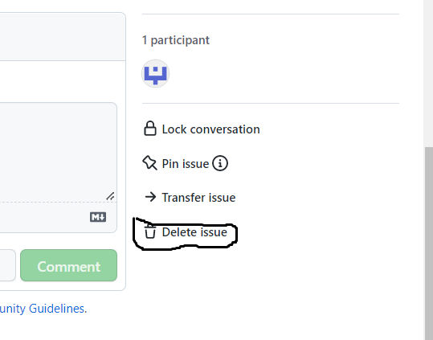

    이슈 페이지의 우측 하단을 보면 'Delete issue' 버튼을 볼 수 있다. 이 버튼을 누르면 이슈가 삭제된다. 이슈를 삭제하면, 이슈에 대한 내용이 완전히 지워지며 나중에 다시 볼 수 도 없다. 히스토리를 남기기 위해서는 Delete issue 보다는 Close 하는 것이 좋다.

- 1.4 깃허브 이슈 이전

    - 이슈를 다른 저장소로 Transfer 할 수도 있다. Delete issue 메뉴 바로 위에 있는 Transfer issue를 누르면 해당 이슈를 다른 저장소로 이전시킬 수 있다.

    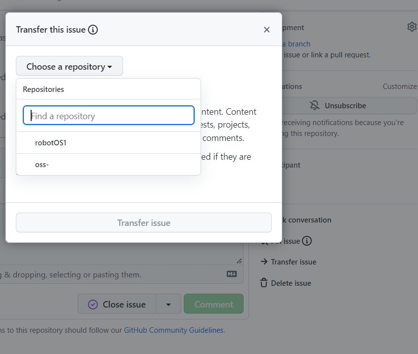

    이전할 저장소를 선택할 수 있다. 사용자 문의나 사용자로부터 받은 버그를 내부 작업용으로 돌리거나 내부 저장소에서 다루던 이슈를 공론화 시키고 싶을 때 사용할 수 있다.

- 1.5 깃허브 이슈 핀하기

    - 몇몇 중요한 이슈는 핀을 해놓을 수 있다. 마찬가지로 이슈 페이지 오른쪽 하단에 있는 Pin issue 메뉴를 선택하면 된다.

    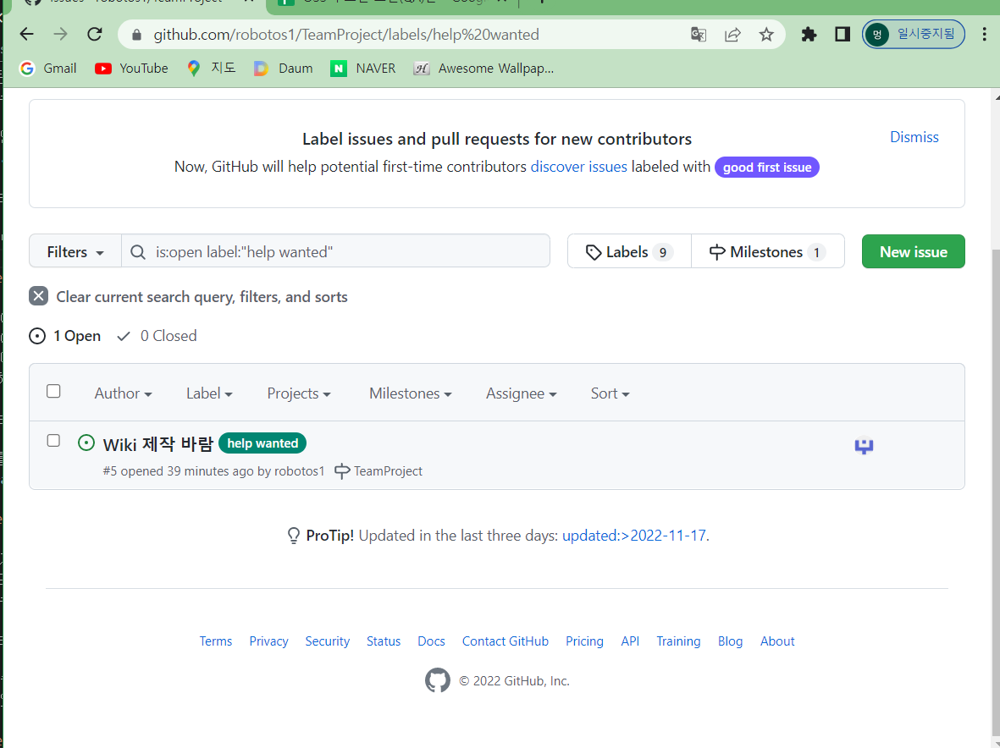

    그러면 이슈 탭 상단에 핀한 이슈가 먼저 보인다. 이슈가 많아져서 다음 페이지로 즁요한 이슈가 넘어간 경우에 Pin을 해놓으면 바로 위에서 볼 수 있다. 프로젝트 진행 사항 페이지나 중요한 설계 이슈, 꼭 논의해야하는 이슈 들을 Pin해서 위로 올릴 수 있다.
    

 이슈 사용 평가

    - 이벤트를 처리하는 속도를 빠르게 해결하여 일의 능률을 높일 수 있어 좋았다.
    - 코드 안정성을 높여 줄 수 있다는 것을 알게 되었다.

## 레이블

- 2.1 깃허브 이슈 라벨 생성
    
    - 저장소에서 발생하는 다양한 이벤트, 협업거리들이 이슈로 만들어진다. 따라서 다양한 종류의 이슈가 생성되어 이슈 탭에 섞인다. 각 이슈가 어떤 종류인지 구별하기 위해 Label 기능을 사용할 수 있다.

    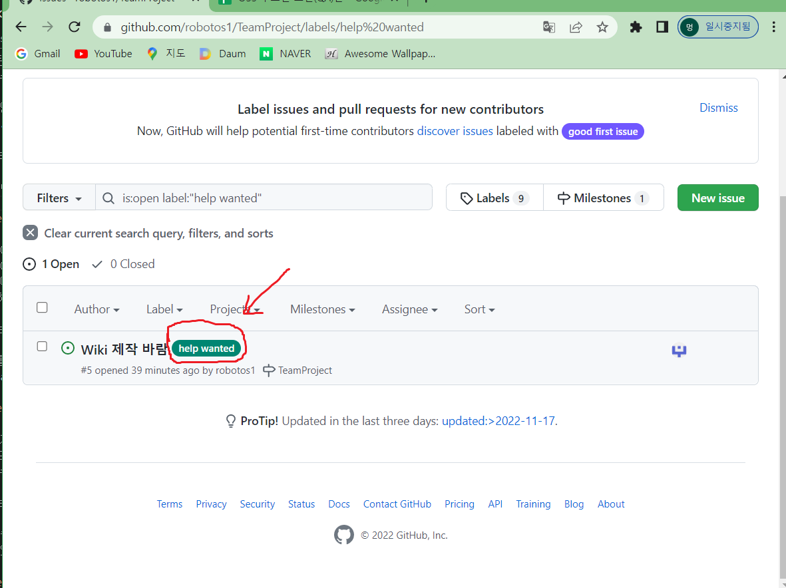

    - 이슈에 라벨을 붙여 놓으면 각 이슈가 버그인지 문서작성을 위한 이슈인지 등을 빠르게 확인할 수 있다. 특정 라벨이 붙은 이슈만 따로 검색할 수도 있다.

    이슈에 붙인 라벨은 새로 추가하거나 제거, 편집할 수 있다.

    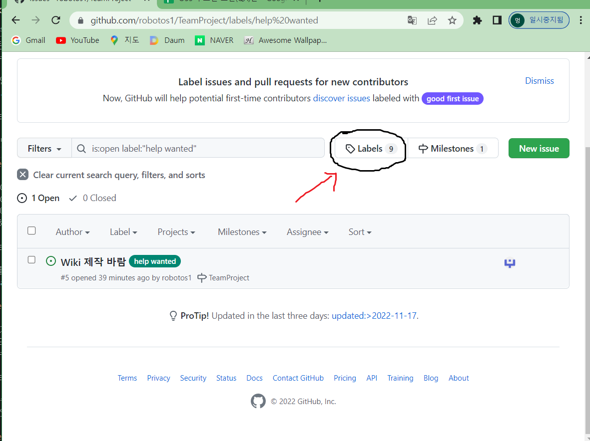

    이슈 탭에서 'Lables' 버튼을 누르면 편집할 수 있는 페이지가 뜬다.

    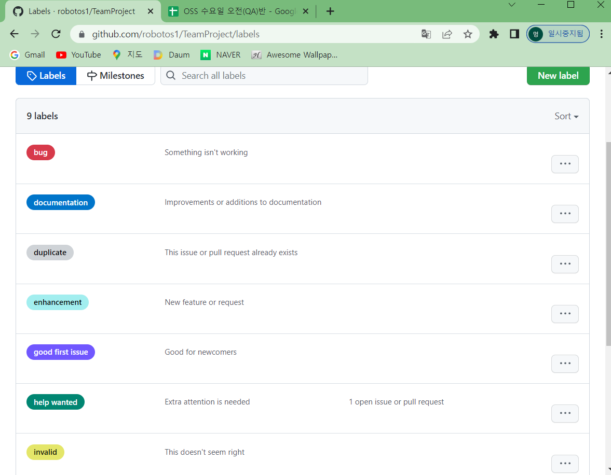

    여기에서 'New Label' 버튼을 눌러서 새로운 라벨을 추가할 수도 있고, 각 라벨 오른쪽 끝에 점 세개짜리 버튼을 눌러서 기존 라벨을 지우거나 편집할 수도 있다.

- 2.2 깃허브 이슈 템플릿 만들기

    - 깃허브는 새로 생성되는 이슈에 '템플릿' 기능을 제공한다. 비슷한 이슈의 경우 내용 구성이 비슷하다. 버그의 종류와 상관없이 레이아웃을 지켜야 협업하기 편하다.

    깃허브는 이슈를 위한 템플릿 등록을 지원하고 있다. 깃허브 저장소의 Setting 탭에서 

    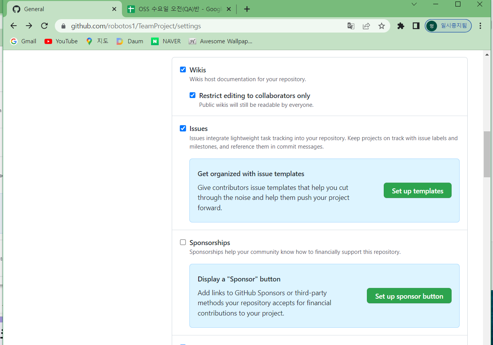

    'Features' 항목을 보면, 'Issues'라는 부분이 있고 'Set up tmplates라는 버튼이 있다. 이 버튼을 누르면 이슈 템플릿을 등록할 수 있는 화면이 나온다.

    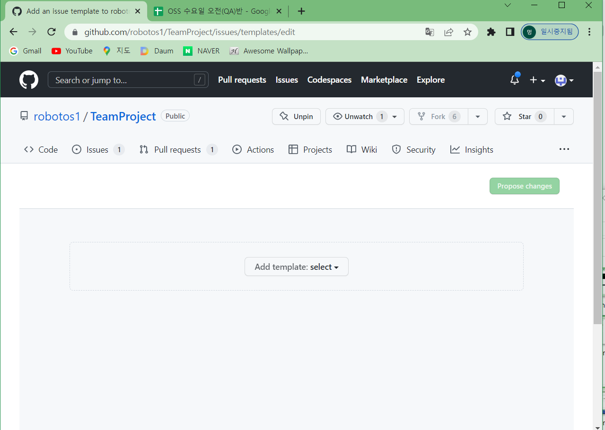

    최초에는 등록된 이슈 템플릿이 없어서 이런 화면이 나온다. 여기서 'Add template: selct'를 클릭하면

    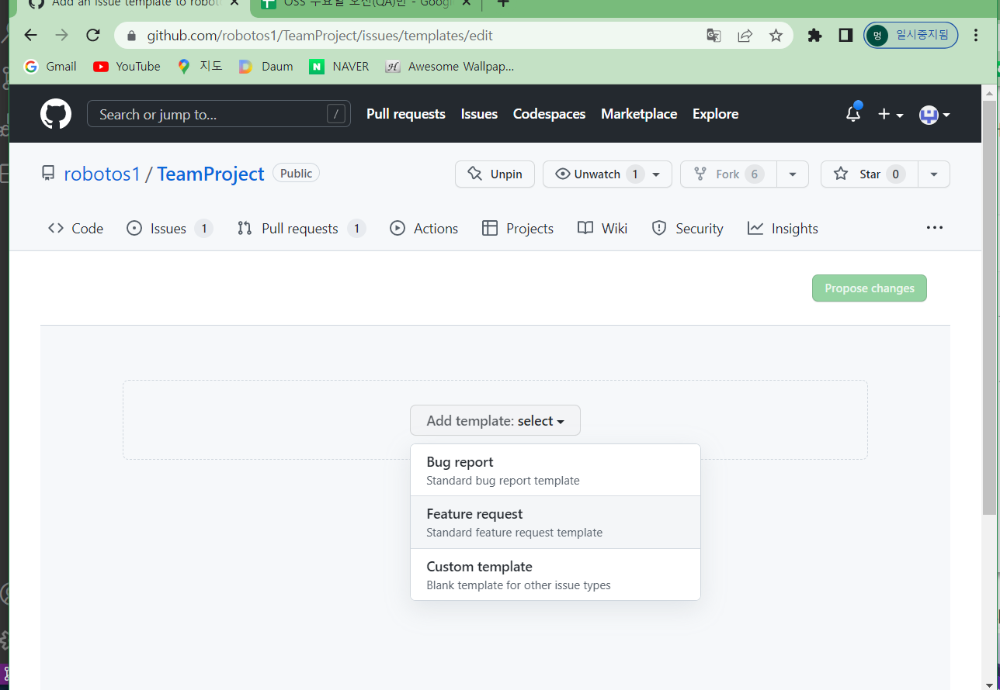

    추가할 이슈 템플릿의 타입이 나온다. 버그 리포트를 위한 템플릿과 기능 추가 요청을 위한 템플릿 그리고 그 밖의 사용자들이 쓸 수 있는 템플릿이 있다.

    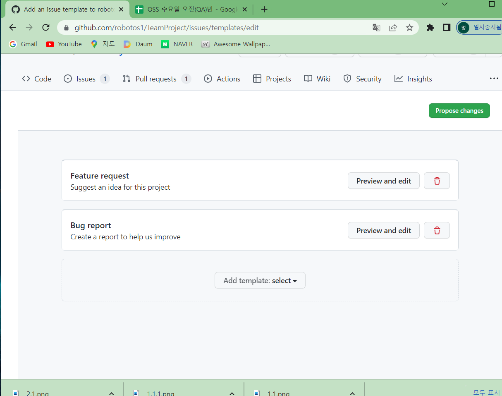

    위와 같이 하나씩 추가해나가면 된다. 'Preview and edit' 버튼을 눌러서 추가한 템플릿을 수정할 수 있다.

    

    적당하게 템플릿 컨텐츠와 이름, 설명을 추가해준다.

    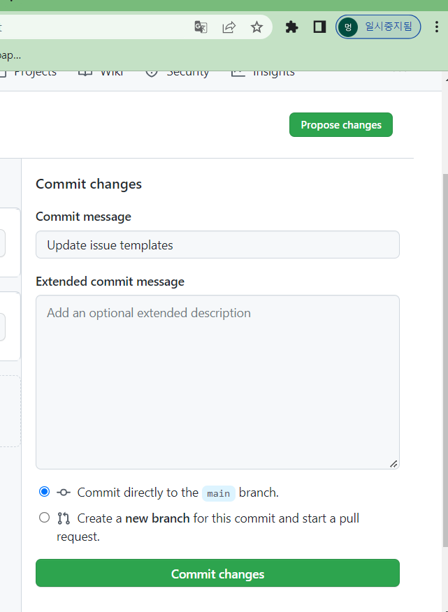

    템플릿 수정이 끝나면 우측 상단에 있는 'Propose changes' 버튼을 눌러서 변경 사항을 반영해준다. 

    이슈 탭에서 새로운 이슈를 등록하기 위해 'New Issue'버튼을 누르면

    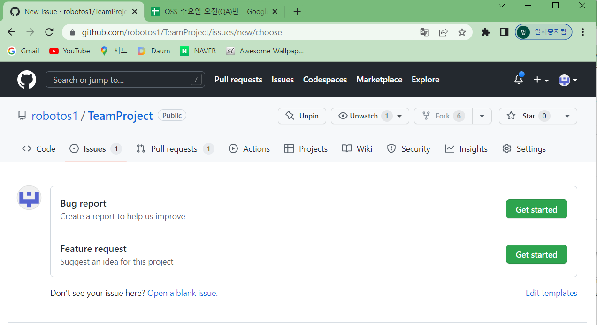

    어떤 타입의 템플릿을 사용할 지 선택할 수 있는 메뉴가 나온다. 버그 리포트를 위해서 이슈 등록을 하려고 했으면, Bug report 항목의 'Get started'를 눌러서 이슈 생성을 진행한다.

    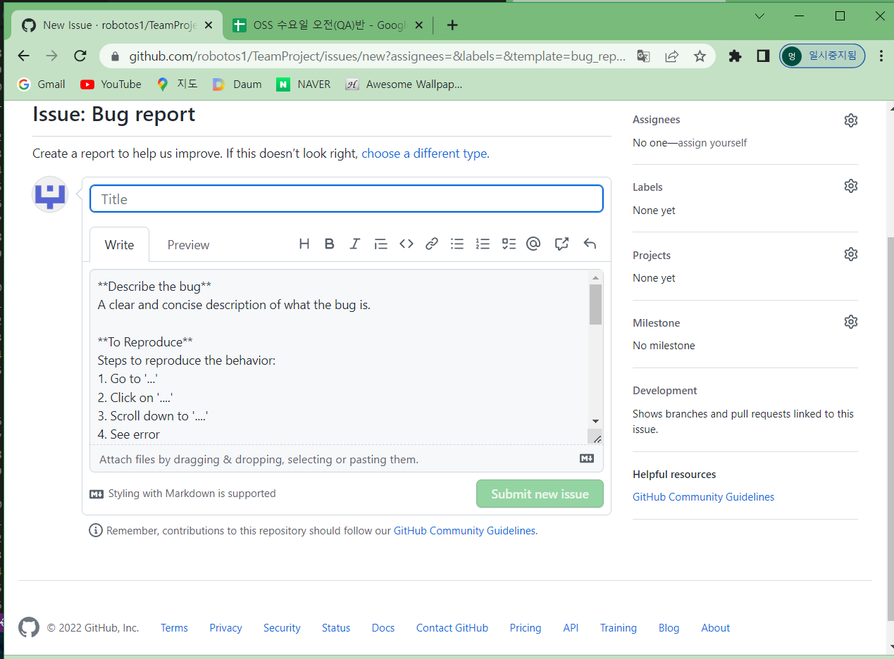

    그러면 새로 이슈를 등록하는 화면이 나오고 텍스트 영역에 템플릿으로 등록해 놓은 내용이 출력된다.
    

레이블 사용 평가

    - 이벤트의 종류를 분류할 있어 도움이 필요한 곳에서는 도움을 요청할 수 있고, 여러 사람이 한눈에 보기 편했다.

## 마일스톤

- 3.1 깃허브 이슈 마일스톤 생성
    - 유사한 이슈들을 하나로 모아 일정관리를 할 수 있는 마일스톤 기능도 제공된다.

    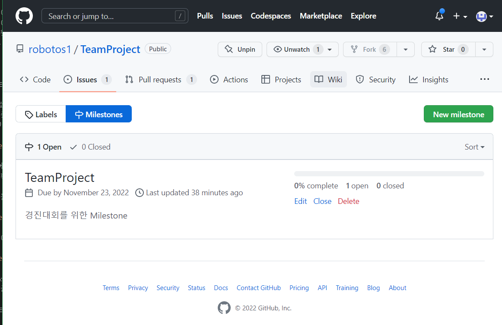

    깃허브으 마일스톤 기능은 '스프린트' 개발 방법론을 지원하기 위한 기능이다. 개발 목표를 마일스톤으로 만들어 두고, 관련된 이슈들을 생성한다 마일스톤을 엮여 있는 이슈들의 Open, Close 상태를 추적하여 전체 이슈 중 몇 개의 이슈가 Close 되었는지 추적해서 마일스톤의 진척상황으로 퍼센트로 보여준다.

    

    새로운 마일스톤은 이슈탭의 'Milestone' 버튼을 이용해서 생성할 수 있다. 마일스톤은 'Due Date'를 설정해놓을 수도 있다. 이 때까지 어떤 일(이슈)들을 해야 하는지 한눈에 파악할 수 있으며, 마일스톤 단위로 일의 진척도를 관리할 수 있다.

마일스톤 사용 평가

    - 일의 진척도를 편하게 볼 수 있어 어떤 일을 해야할지 감을 잡기 편했다.

## PR
오픈소스 프로젝트에 참여할 때 가장 기본이 되는 동작

- 4.1 Pull Request 보내기
    - 먼저 기여하려는 저장소를 나의 저장소로 fork 합니다.

    

    그 다음 fork한 저장소에 가면 정상적으로 fork가 되었음을 확인할 수 있습니다.

    

    fork를 한 저장소를 git bash에서 클론을 합니다.

- 4.2 원격 저장소 Remote 설정

    - Clone 해 온 저장소에 원격 저장소 설정을 합니다.
    - 원격 저장소의 git 주소는 fork를 하기 전 원래의 저장소를 말한다.
    - 이작업은 추후에 fork 저장소를 원격 저장소의 최신 커밋으로 내용을 변경해야 하므로 진행해야 합니다.

    

- 4.3 PR용 branch 생성하기

    - clone 해 온 저장소의 처음 branch는 기본적으로 master인데, 여기에 코드를 수정하고 PR을 보낼 용도로만 사용할 새로운 branch를 생성해야 합니다.

    - 아래 명령어에서 test 에는 원하는 branch명을 써주시면 됩니다.

    

- 4.4 코드 수정

    - 위 명령어를 통해 branch가 만들어짐과 동시에 현재 branch도 새로 만든 것으로 변경됩니다.

    - 이제 지금 이 branch에 오픈소스에서 기여할 부분을 수정합니다.

    - 코드 수정 완료 후 아래 코드를 입력합니다.

    

- 4.5 PR용 branch에 Push하기

    - 이 부분에서 현재 들어와 있는 PR용 branch에 push를 합니다.
    - test에는 위에서 지정한 branch 명으로 바꿔서 아래 명령어를 실행합니다.
    - $ git push origin test

- 4.6 fork한 github 사이트 들어가기

    - 이제 github 사이트에서 fork해온 나의 저장소에 들어갑니다
    - 
    - Compare & pull request 버튼이 활성화 된 것을 확인할 수 있고, 버튼을 누르면

    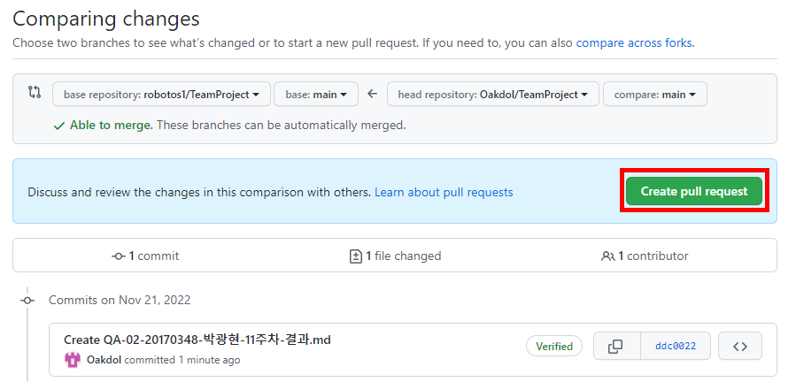

    pull request 양식이 뜬다.

    그 다음 Create pull request 버튼을 눌러, 오픈소스 프로젝트에서 나의 PR이 승인되어 merge 될 때 까지 기다립니다.

- 4.7 pr 승인 완료 후 branch 삭제

    - 내가 보낸 PR이 승인되어 메인 저장소에 merger 되었다면, 이제 위에서 생성한 PR용 branch를 삭제해줍니다.

 PR 사용 평가

    - 팀원들 끼리 빠른 공유가 가능하고, 한번에 모아서 한번에 보낼수있어 매우 편했다.

## 위키

소프트웨어 프로젝트에서 소스코드 만큼 중요한 것이 개발문서이다. 잘 작성된 개발 문서는 커뮤니케이션 비용을 줄여주고, 버그를 생성할 가능성을 낮춰준다.

- 5.1 위키의 활성/비활성
    
    - 깃허브 저장소를 생성하면 기본적으로 위키 페이지가 자동으로 생성된다.

    

    깃허브 저장소 페이지에서 'Wiki'탭을 누르면 깃허브의 위키 기능을 사용할 수 있다. 'Wiki' 탭이 보이지 않는 경우라면 저장소에서 위키 기능이 비활성화 되어 있는 상태이므로 'Setting' 탭으로 가서 Features 항목에서 Wikis 체크박스를 선택하여 활성 비활성을 할 수 있다.

- 5.2 깃허브 위키 페이지

    - 깃허브 저장소의 'Wiki' 탭으로 들어가면 위키 페이지를 볼 수 있다. 만약 작성된 위키 페이지가 없다면 새로운 페이지를 작성할 수 있다. 생성된 위키 페이지가 없다면 화면 중앙에 나오는 'Create the first page' 버튼을 눌러서 첫 위키 페이지를 작성할 수 있다. 이미 위키 페이지가 있는 경우 오른쪽 상단에 'Edit' 버튼을 눌러서 현재 보고 있는 위키 페이지를 수정하거나 'New' 버튼으로 새로운 위키 페이지를 생성할 수도 있다.

    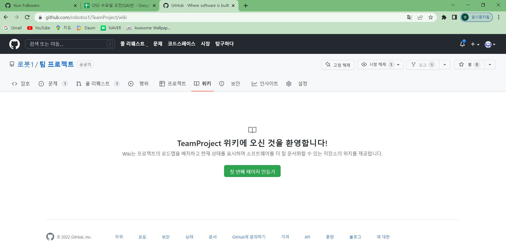

    위키페이지는 마크다운 문법으로 작성하거나 수정할 수 있다.
    
    - 위키 에디터의 가장 하단에는 'Edit message' 섹션이 있다. 이 부분에는 소스코드의 커밋로그처럼 위키 문서를 왜 수정했는지 간략한 요약을 적어둘 수 있다.

    - 위키도 별도의 git 저장소로 관리되어 오른쪽 하단의 저장소 주소가 있다. 이주소를 이용하여 clone하고 VSCode로 에디터를 편집할 수도 있다.

- 5.3 사이드바와 바닥글

    - 깃허브 위키에 문서를 추가하다보면 '메뉴' 혹은 '카테고리' 같은 구성으로 하려면 위키 페이지 오른쪽 'Pages' 부분에는 위키 문서들이 알파벳 순으로 정렬되어 있다.

    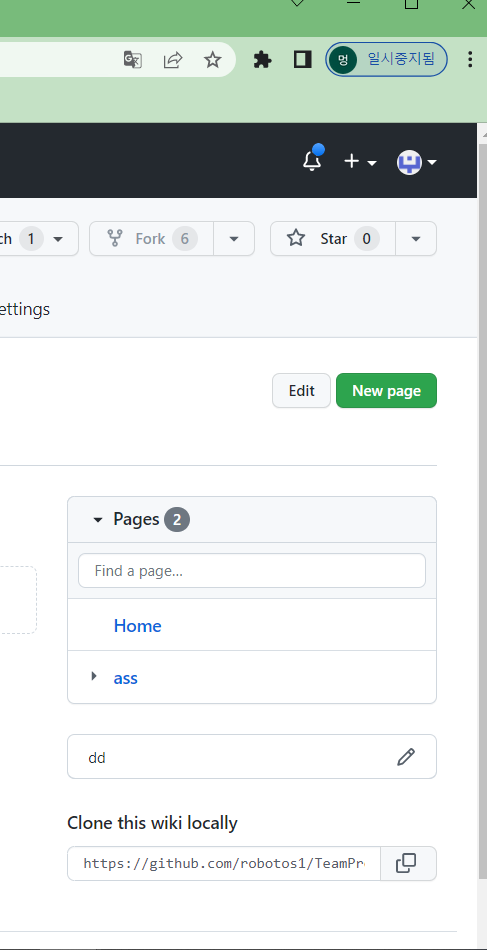

    개발문서는 대부분 제목의 알파벳 순서가 아닌 비슷한 주제로 묶어서 보는 편이기 떄문에 Sidebar 기능을 이용하면 문서들을 카테고리화할 수 있다.

    Pages 항목 아래쪽에 '+Add a custom sidebar' 버튼을 누르면 사이드바 편집이 가능한 에디터 창이 나온다.

    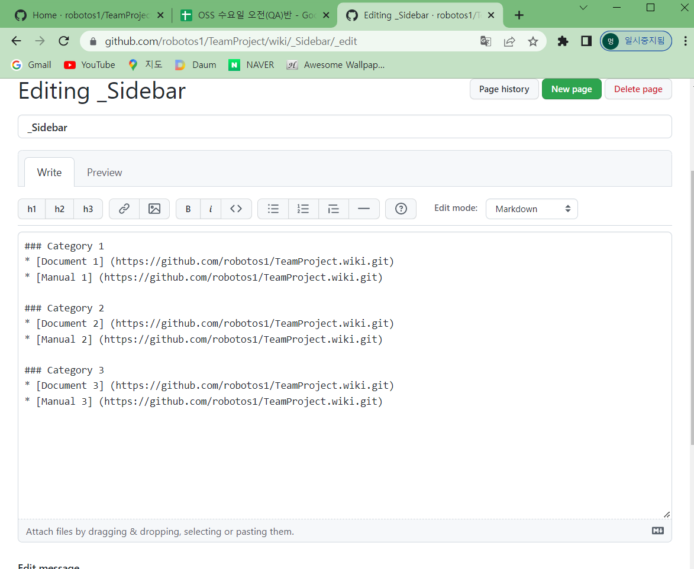

    위 사진처럼 설정을 하면

    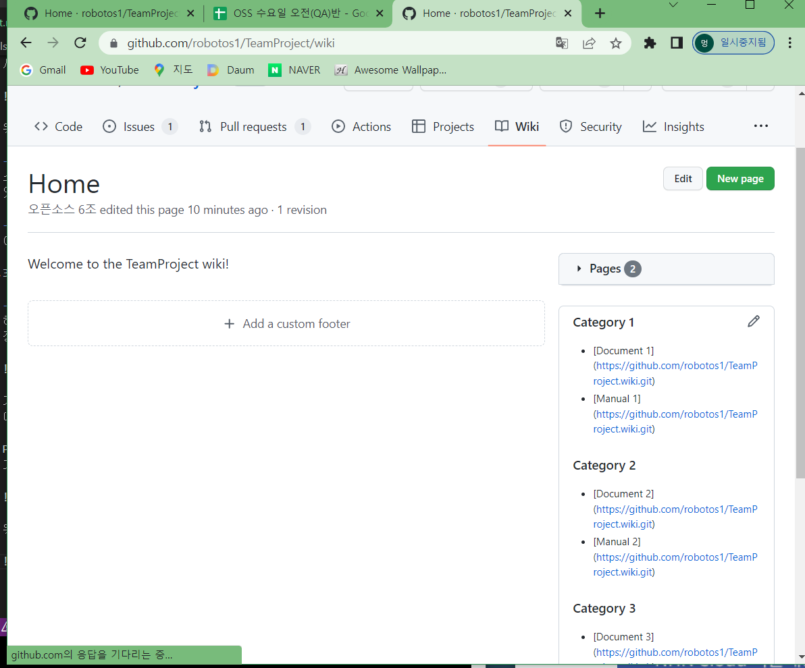

- 5.4 이미지 추가

    - 깃허브 이슈에서처럼 위키 페이지에 이미지를 추가하면 좀 더 이해하기 쉬운 문서를 작성할 수 있다. 하지만 위키 에디터는 깃허브 이슈에서처럼 이미지를 드래그&드롭으로 쉽게 업로드하는 기능을 제공하지 않는다.

    - 위키에서 이미지를 사용하는 가장 쉬운 방법은 이슈 혹은 이슈이 커멘트 에디터에 이미지를 드래그앤드랍 하는 것인데, 업로드 된 이미지가 마크 다운으로 표시된다.

    - 위와 같은 방법으로 업로드된 이미지를 사용자가 관리할 수 없기에 정상적인 방법으로는 위키 저장소를 clone하여 image 디렉토리를 만들고, 그곳에 업로드해서 위키 문서와 함께 사용하는 것이다.

- 5.5 위키 히스토리

    - 위에서 위키 문서도 깃 저장소로 관리가 되기에 위키 문서의 수정 히스토리도 조회 할 수 있다.

     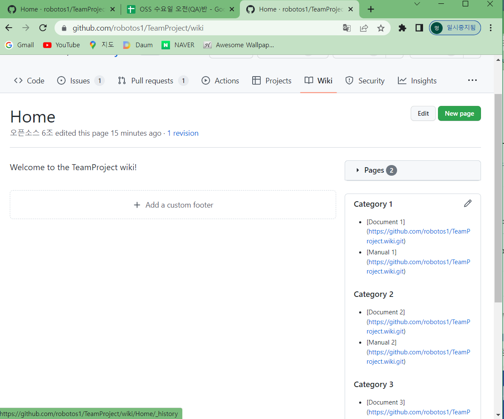

     위키 페이지의 상단을 보면 몇번 수정되었는지 확인할 수 있고, '1 revision' 부분을 클릭하면 수정 히스토리도 조회할 수 있다. 특정 부분과 현재 페이지가 어떤 부분이 다른지 diff도 조회가 가능하다.

- 5.6 위키 문서 검색

    - 깃허브 전체 범위에서 검색을 할 수도 있고, 특정 저장소나 Organization 범위에서 검색을 할 수도 있다.

    위키 검색을 할 때 문서의 검색 범위를 지정하기 위해서는 다음을 추가하면 된다.

    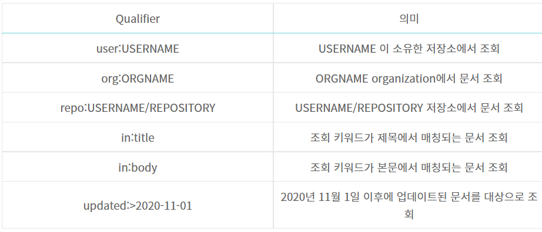

    in:title 혹은 in:body 퀄리파이어가 검색 쿼리에 포함되지 않으면 둘 다를 대상으로 한다.

 위키 사용 평가

    - 정리를 잘해놓은 상태로 커뮤니케이션 비용을 줄여주어 프로젝트 관리에 용이하였다.

    
## 프로젝트

프로젝트는 작업 현황과 진행도를 볼 수 있는 메뉴이다. 이슈, PR들을 하나의 작업으로 구분해 그 작업이 현재 어느 정도 진행되었는지 확인할 수 있다.

- 6.1 프로젝트 종류 
  - To Do : 해야 할 작업
    - 새로 추가 되는 모든 이슈가 해당
    - 새로 추가 되는 모든 PR이 해당
  - In Progress : 진행 중인 작업
    - 작업이 진행중 이라는 것을 의미
    - 새로 열린 모든 PR이 해당
    - 새로 열린 모든 이슈가 해당
  - Done : 완료된 작업
    - 이슈가 Close되면 해당
    - Merge가 된 PR이 해당
  -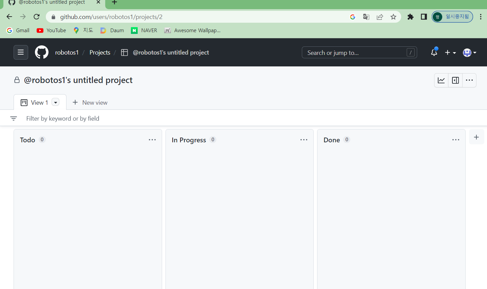
  - 프로젝트를 사용하면 위와 같은 세개의 기능을 제공하는데 이것을 통하여 프로젝트의 진행상황을 한번에 파악하기 수월하다.
  

 프로젝트 사용 평가

    - 프로젝트가 얼마나 진행이 되었는지 하나의 작업으로 구분하여 한눈에 볼 수 있어 편리함이

